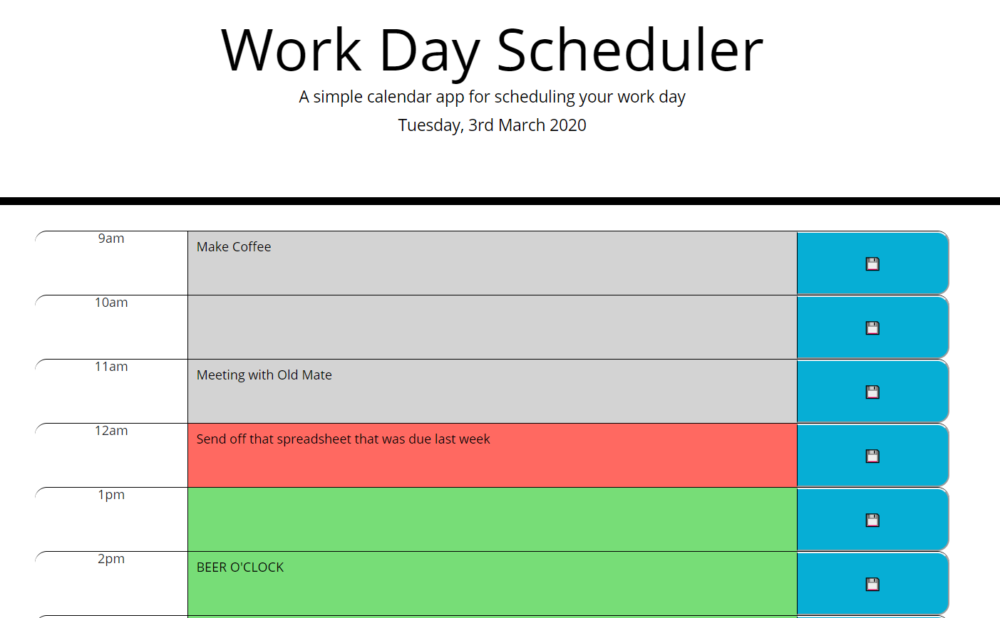

# Third-Party APIs: Work Day Scheduler
Homework Week 5 - Third-Party APIs: Work Day Scheduler 
Author: Foti Mougos 
[Deployed At Github](https://foteye.github.io/Wk5-API-DayPlanner-FotiMougos/ "Deployed at Github")

### Brief:
Create a simple calendar application that allows the user to save events for each hour of the day. This app will run in the browser and feature dynamically updated HTML and CSS powered by jQuery. We will be using moment.js library to view and update the time.

The program should allow users to:
* When opened, the planner should display the current day
* Timeblocks should be visible for standard business hours
* Timeblocks should be colour coded for past, present, future
* Events should be clickable, and you should be able to type in them
* Events should persist in local storage
* Events should persist when the page is refreshed

### Website Demo

### Lessons Learned:

  * Going to use more Let's in my functions to keep variables scoped
  * Event handlers must be set after any procedurally generated html is appended
  * I'm starting to get over localStorage
  * Storing data that will not change (like dates) in the actual key is a really neat way
  * Moment.js makes things easy but their documentation sucks. Go stack overflow..